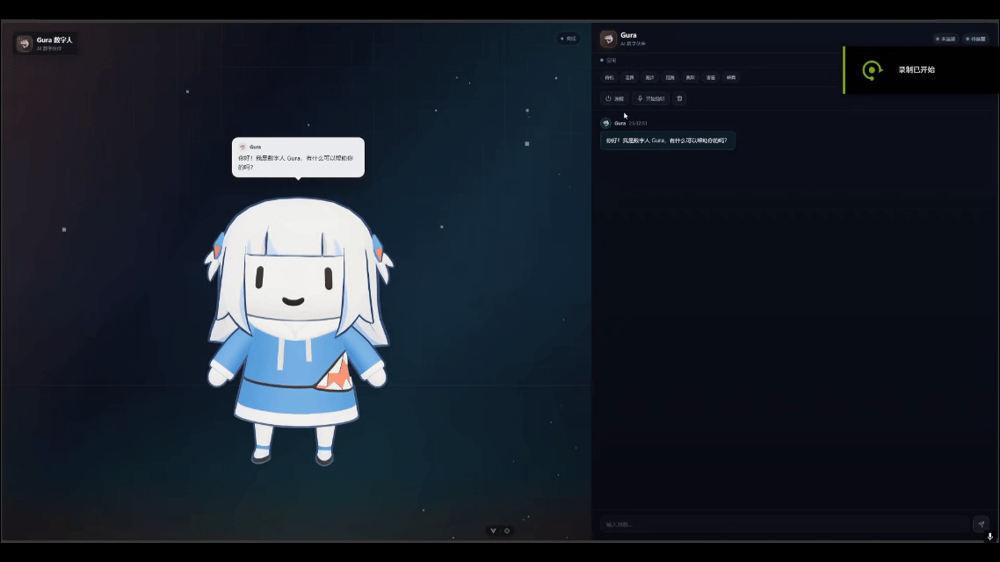
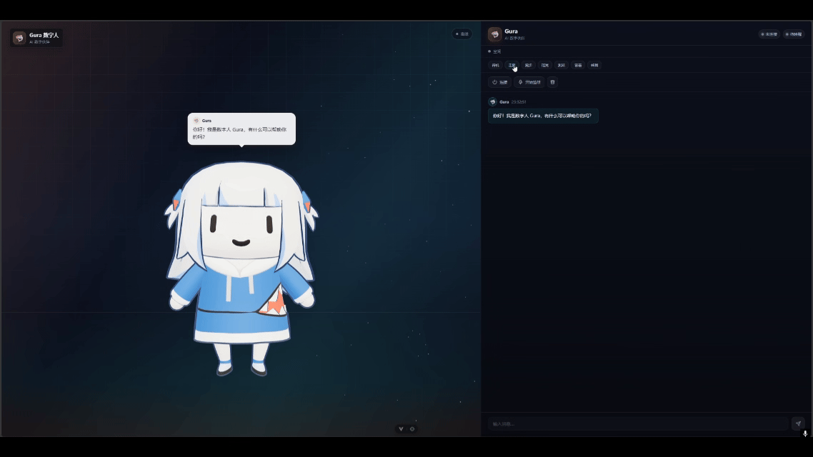
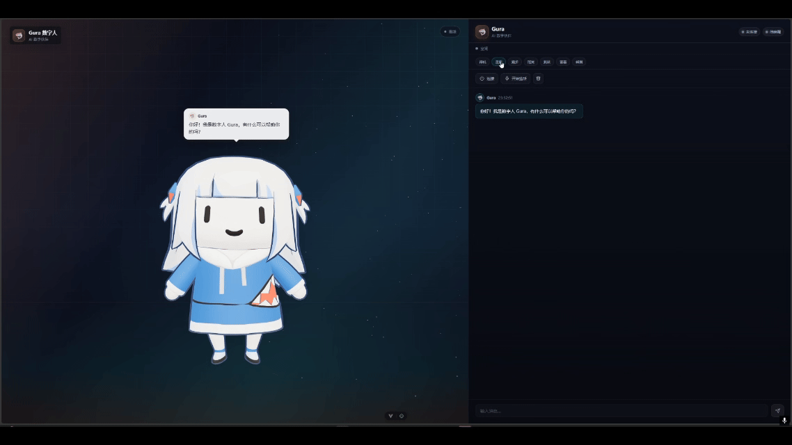
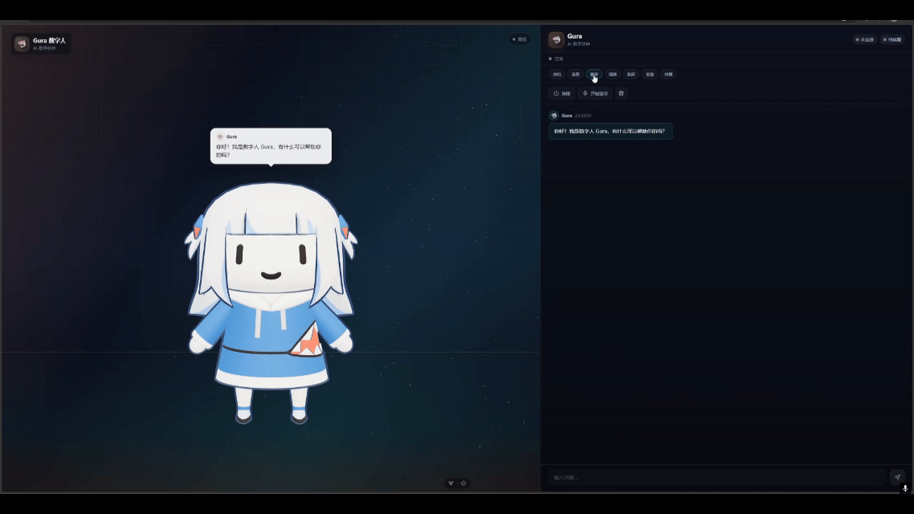
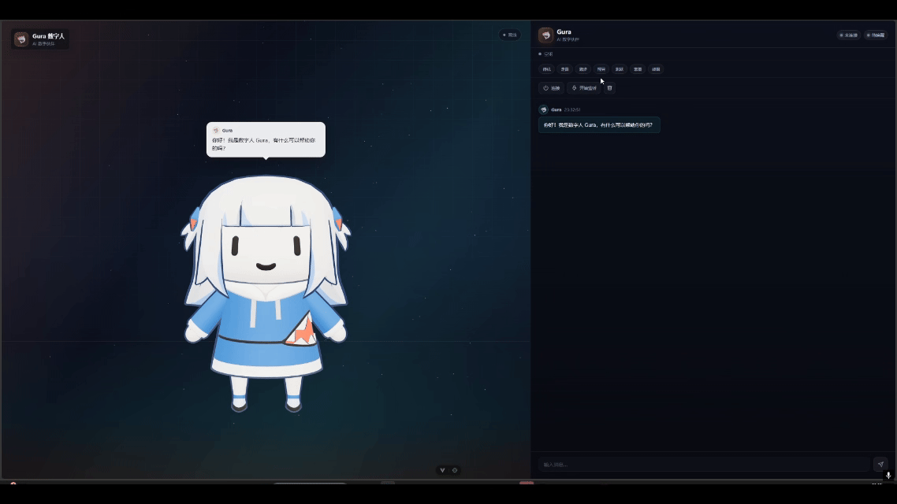
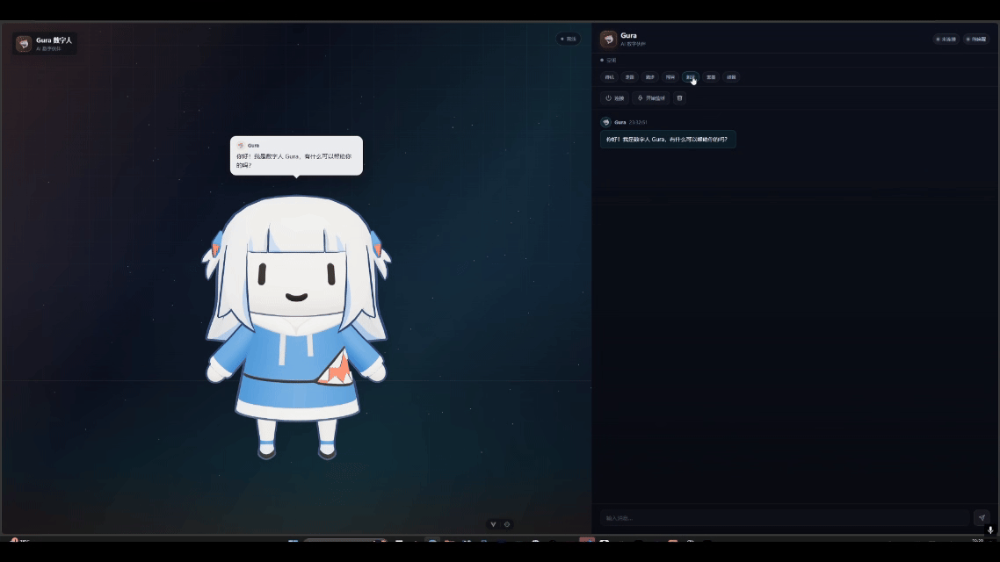
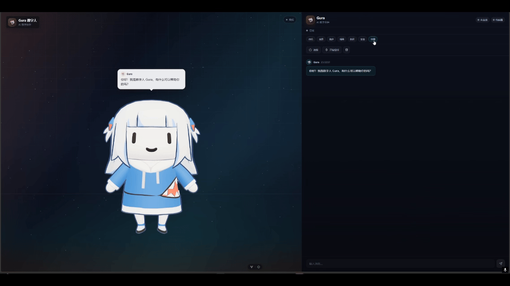

# Gura Agent — 数字人 3D 交互前端

> 基于 Vue 3 + Vite + Three.js 的 Gawr Gura 数字人前端。模型与动作由 Blender 制作并打包进 GLB，前端通过 WebSocket 与后端对话服务连接。

## 目录

1. 项目简介
2. 快速开始
3. 功能总览
4. 前端架构设计
5. 界面设计
6. 动作设计
7. 代码结构
8. 后端接口
9. 构建与部署
10. 常见问题
11. 维护与扩展

## 1. 项目简介

Gura Agent 是一个带 3D 数字人的实时对话前端，主要能力包括：

- 加载 Gawr Gura GLB 模型，支持骨骼动画
- 7 个动作按钮，可单独预览：待机、走路、跑步、摇晃、跳跃、害羞、转圈
- 动作采用淡入淡出切换，非待机动作播放完成后自动回到待机
- WebSocket 实时连接后端，接收唤醒、对话、告别等状态
- 响应式布局，桌面端左右分栏，移动端上下分栏
- 文字输入、语音监听、连接管理、清空对话等交互入口

前端可以独立启动预览，不连接后端时仍可查看 3D 模型和动作按钮。

## 2. 快速开始

### 2.1 环境要求

- Node.js `^20.19.0` 或 `>=22.12.0`
- npm

### 2.2 安装依赖

```bash
npm install
```

### 2.3 启动开发服务器

```bash
npm run dev
```

默认地址：<http://localhost:5173>

### 2.4 常用命令

| 命令 | 说明 |
|------|------|
| `npm run dev` | 启动 Vite 开发服务器 |
| `npm run build` | 生产构建，输出到 `dist/` |
| `npm run preview` | 本地预览生产构建 |
| `npm run lint` | ESLint 检查并自动修复 |

## 3. 功能总览

### 3.1 3D 数字人

- 页面加载后自动请求 `public/古拉_actions.glb`
- 模型加载期间显示“正在唤醒 Gura”加载态
- 加载失败显示“模型加载失败”
- 模型加载完成后自动归一化到合适高度并居中

### 3.2 动作预览

右侧控制面板提供 7 个动作按钮，点击后立即切换动作：

| 按钮 | GLB 动画名 | 时长（约） | 行为 |
|------|------------|-----------|------|
| 待机 | `idle` | 1.2s 循环 | 循环待机 |
| 走路 | `ParadeWalk` | 0.7s | 单次播放 |
| 跑步 | `GuraRun` | 1.2s | 单次播放 |
| 摇晃 | `GuraShake` | 2.1s | 单次播放 |
| 跳跃 | `GuraJump` | 1.2s | 单次播放 |
| 害羞 | `Shy` | 2.6s | 单次播放 |
| 转圈 | `Gura Around` | 1.8s | 单次播放 |

#### 动作演示 GIF

演示 GIF 存放在 `public/演示gif/` 目录：

| GIF | 演示 |
|------|------|
| 待机 |  |
| 走路 |  |
| 跑步 |  |
| 摇晃 |  |
| 跳跃 |  |
| 害羞 |  |
| 跳舞 |  |

### 3.3 对话交互

- 页面加载后自动连接 `ws://localhost:8000/ws/conversation`
- 未连接后端时显示离线状态
- 已连接时可输入文字发送给后端
- 可手动开始/停止语音监听
- 后端状态变化会驱动对应动作和气泡文本

## 4. 前端架构设计

### 4.1 总体架构

```text
main.js
  └── App.vue
        ├── Model.vue       3D 舞台、加载态、头部气泡
        └── ChatBox.vue     聊天面板、动作按钮、连接控制
              └── chatStore.js    Pinia 状态与 WebSocket
                      └── model.js    GLB 加载与动作控制
                              └── index.js    Three.js 场景、相机、灯光
```

核心设计原则：

- Three.js 渲染器、场景、相机在 `src/index.js` 中作为模块级单例创建
- GLB 模型与动画在 `src/model.js` 中加载并维护
- WebSocket、消息、状态、监听动作全部收口在 Pinia Store
- Vue 组件只负责界面渲染、事件转发和布局

### 4.2 启动与渲染流程

1. `src/main.js` 创建 Vue 应用并挂载 Pinia
2. `App.vue` 使用 CSS Grid 分成 3D 舞台和聊天面板
3. `Model.vue` 挂载时把全局 `renderer.domElement` 放进模型容器
4. `model.js` 使用 `GLTFLoader` 加载 `public/古拉_actions.glb`
5. 加载完成后计算包围盒并归一化模型
6. `AnimationMixer` 注册 7 个动作并启动动画循环
7. `ChatBox.vue` 通过 `triggerAction(name)` 触发动作

### 4.3 Three.js 场景设计

`src/index.js` 负责：

- 创建 `WebGLRenderer`，开启抗锯齿、sRGB 输出、ACES 色调映射
- 创建透视相机，初始位置 `(0, 0.65, 11.4)`
- 使用 `RoomEnvironment` 生成环境贴图
- 添加半球光、主光、轮廓光、补光
- 生成 240 个随机星点
- 禁用 OrbitControls 的旋转、缩放、平移
- 暴露 `resizeRenderer` 供组件响应容器尺寸变化

### 4.4 状态管理

`src/stores/chatStore.js` 使用 Pinia 管理：

| 状态字段 | 说明 |
|----------|------|
| `messages` | 对话消息列表 |
| `inputMessage` | 输入框内容 |
| `wsConnection` | WebSocket 实例 |
| `isConnected` | 是否已连接 |
| `connectionStatus` | 连接状态 |
| `digitalHumanState` | 数字人后端状态 |
| `statusText` | 状态栏文案 |
| `wakeWords` | 唤醒词列表 |
| `listeningActive` | 是否正在监听 |
| `conversationCount` | 对话次数 |
| `connectionCount` | 连接次数 |
| `heartbeatTimer` | 心跳定时器 |

Store 提供以下能力：

- `initWebSocket` / `disconnect`
- `handleWsMessage` / `handleStateChange`
- `sendMessage` / `addMessage`
- `startListening` / `stopListening`
- `clearMessages`
- `startHeartbeat` / `stopHeartbeat` / `sendHeartbeat`

### 4.5 模型加载与归一化

`src/model.js` 的 `normalizeModel()` 会：

1. 调用 `updateMatrixWorld(true)` 更新世界矩阵
2. 用 `Box3` 计算模型包围盒
3. 取得模型尺寸和中心点
4. 以目标高度 `3.2` 计算缩放比例
5. 把模型移动到画面中央，并向下偏移 `0.55`

所有 `Mesh` 都会关闭 `frustumCulled`，避免模型局部被错误裁剪。

## 5. 界面设计

### 5.1 布局

桌面端：

```text
┌──────────────────────────────┬──────────────────┐
│                              │  Gura 品牌区      │
│  3D 舞台                      │  连接状态         │
│  Model.vue                   │  动作按钮         │
│                              │  消息列表         │
│                              │  输入框           │
└──────────────────────────────┴──────────────────┘
```

- 左侧舞台占 `1.45fr`
- 右侧聊天面板最小宽度 `380px`

移动端（`max-width: 960px`）：

- 改为单列布局
- 上方 3D 舞台占 `48vh`
- 下方聊天面板占 `52vh`
- 顶部连接状态胶囊在移动端隐藏

### 5.2 色彩与视觉

全局设计变量定义在 `src/style.css`：

| 变量 | 值 | 用途 |
|------|-----|------|
| `--bg-0` | `#07090f` | 页面底色 |
| `--bg-1` | `#0d1120` | 舞台底色 |
| `--text` | `#edf0f8` | 主文字 |
| `--fox` | `#ff8a4c` | Gura 橙色强调色 |
| `--voice` | `#39d6d0` | 语音/连接青色 |
| `--danger` | `#ff5d6c` | 错误/断开 |
| `--gold` | `#ffcf6e` | 连接中状态色 |

视觉特征：

- 深色舞台背景，叠加青橙双色渐变光
- 半透明网格地面，带渐变遮罩
- 底部青色/橙色环境光
- 顶部品牌标签使用毛玻璃效果
- 聊天面板使用半透明深色渐变

### 5.3 主要组件

#### Model.vue

- `model-container`：3D 渲染容器
- `stage-bg`：舞台背景
- `stage-grid`：网格地面
- `stage-light`：底部光带
- `model-loader`：加载遮罩与转圈动画
- `speech-bubble`：AI 气泡，跟随模型头部位置

气泡定位逻辑：

- 调用 `getModelHeadPosition()` 获取头部世界坐标
- 使用 `project(camera)` 转换到屏幕坐标
- 通过 `clamp` 限制气泡不超出容器
- 监听 `resize`、`ResizeObserver`，并每 180ms 更新一次位置

#### ChatBox.vue

- `panel-header`：品牌、连接胶囊、监听胶囊
- `state-line`：数字人当前状态
- `action-bar`：7 个动作按钮
- `panel-actions`：连接、监听、清空按钮
- `messages`：对话消息列表
- `composer`：输入框与发送按钮

### 5.4 交互与动效

- 按钮 hover 时上浮 `1px`，边框变亮
- 连接成功后状态胶囊显示青色呼吸点
- 连接中显示金色呼吸点
- 消息进入使用 `messageIn` 动画
- 气泡切换使用淡入淡出和轻微缩放
- 模型加载使用旋转圆环

## 6. 动作设计

### 6.1 Blender 动作制作

动作在 Blender 中制作，并整理为独立 NLA 轨道：

1. 打开古拉模型的 Blender 工程
2. 在 NLA 编辑器中为每个动作建立独立轨道
3. 确认动作名称：`idle`、`ParadeWalk`、`GuraRun`、`GuraShake`、`GuraJump`、`Shy`、`Gura Around`
4. 导出动作 GLB
5. 使用合并脚本把动作轨道合并回原模型

### 6.2 为什么使用合并脚本

直接让 Blender 重新导出整个模型，可能破坏原模型网格坐标，例如模型头部压缩、位置偏移等问题。

`scripts/merge_gura_nla_actions.mjs` 的处理方式：

- 读取动作 GLB 和原始模型 GLB
- 按节点名匹配骨骼
- 只复制动作中的 `rotation` 通道
- 将动作对应的 bufferView、accessor 追加到原模型
- 写入新的 `public/古拉_actions.glb`

这样动作可以生效，同时保留原模型网格、贴图、坐标和头部姿态。

### 6.3 动作清单

| 前端按钮 | GLB 动画名 | 时长（约） | 循环方式 | 说明 |
|----------|------------|-----------|----------|------|
| 待机 | `idle` | 1.2s | 循环 | 自然站立待机 |
| 走路 | `ParadeWalk` | 0.7s | 单次 | 慢速走路摆臂 |
| 跑步 | `GuraRun` | 1.2s | 单次 | 跑步摆臂 |
| 摇晃 | `GuraShake` | 2.1s | 单次 | 身体左右摇晃 |
| 跳跃 | `GuraJump` | 1.2s | 单次 | 原地跳跃 |
| 害羞 | `Shy` | 2.6s | 单次 | 低头害羞 |
| 转圈 | `Gura Around` | 1.8s | 单次 | 原地转圈 |

### 6.4 动作切换实现

`src/model.js` 中的 `fadeToActive()` 负责动作切换：

```js
function fadeToActive(name) {
  if (!mixer || !actions.idle) return

  Object.values(actions).forEach((action) => {
    if (action) action.fadeOut(0.35)
  })

  if (actions[name]) {
    actions[name].reset().fadeIn(0.35)
  }

  if (actionTimer) window.clearTimeout(actionTimer)
  if (name !== 'idle') {
    actionTimer = window.setTimeout(() => fadeToActive('idle'), ACTION_DURATIONS[name])
  }
}
```

行为说明：

- 所有旧动作 0.35 秒淡出
- 新动作重置后 0.35 秒淡入
- 单次动作使用 `LoopOnce` 和 `clampWhenFinished`
- 动作时长 = 动画时长 + 300ms，结束后自动切回待机

### 6.5 后端状态与动作映射

`chatStore.js` 根据后端状态触发动作：

| 后端状态 | 前端动作 |
|----------|----------|
| 连接成功 `connected` | 回到待机 |
| 唤醒成功 `awakened` | 摇晃，5 秒后害羞 |
| 对话中收到回复 `conversing` | 摇晃 |
| 告别 `goodbye` | 摇晃，5 秒后回到待机 |

## 7. 代码结构

```text
Gura-Agent/
├── public/
│   ├── 古拉_actions.glb
│   ├── 古拉.glb
│   ├── smoller_gura_-_gawr_gura_holomyth.glb
│   ├── 模型.glb
│   └── favicon.ico
├── scripts/
│   ├── build_gura_actions.py
│   ├── merge_gura_actions.mjs
│   └── merge_gura_nla_actions.mjs
└── src/
    ├── App.vue
    ├── index.js
    ├── main.js
    ├── model.js
    ├── style.css
    ├── components/
    │   ├── ChatBox.vue
    │   └── Model.vue
    └── stores/
        └── chatStore.js
```

### 7.1 文件职责

| 文件 | 职责 |
|------|------|
| `src/main.js` | Vue 入口，注册 Pinia |
| `src/App.vue` | 页面整体布局 |
| `src/style.css` | 全局设计变量与基础样式 |
| `src/index.js` | Three.js 场景、相机、灯光、渲染循环 |
| `src/model.js` | GLB 加载、模型归一化、动作控制 |
| `src/components/Model.vue` | 3D 容器、加载态、AI 气泡 |
| `src/components/ChatBox.vue` | 聊天面板、动作按钮、连接控制 |
| `src/stores/chatStore.js` | WebSocket、消息、状态、后端动作联动 |
| `scripts/merge_gura_nla_actions.mjs` | 合并 Blender 动作到原模型 |

### 7.2 关键导出接口

`src/model.js` 对外提供：

- `triggerAction(name)`：切换任意动作
- `activeheadAction()`：害羞动作
- `activetailAction()`：回到待机
- `activeMovehandAction()` / `activeshakehandAction()`：摇晃动作
- `reset()`：回到待机
- `getModelHeadPosition()`：获取头部世界坐标
- `waitForModel()`：等待模型加载完成
- `default model`：Three.js Group，挂载到场景

## 8. 后端接口

### 8.1 WebSocket

默认地址：`ws://localhost:8000/ws/conversation`

| 消息类型 | 方向 | 说明 |
|----------|------|------|
| `connected` | 服务端 → 客户端 | 连接成功，包含唤醒词列表 |
| `state_change` | 服务端 → 客户端 | 状态变化通知 |
| `listening_started` | 服务端 → 客户端 | 开始监听 |
| `listening_stopped` | 服务端 → 客户端 | 停止监听 |
| `messages_cleared` | 服务端 → 客户端 | 消息已清空 |
| `ping` | 客户端 → 服务端 | 心跳请求 |
| `pong` | 服务端 → 客户端 | 心跳响应 |
| `get_state` | 客户端 → 服务端 | 查询当前状态 |
| `current_state` | 服务端 → 客户端 | 当前状态回复 |

### 8.2 HTTP 控制端点

| 端点 | 方法 | 说明 |
|------|------|------|
| `POST /control/start` | HTTP | 启动麦克风监听 |
| `POST /control/stop` | HTTP | 停止麦克风监听 |
| `POST /messages/clear` | HTTP | 清空对话历史 |
| `GET /status` | HTTP | 获取系统运行状态 |
| `GET /messages` | HTTP | 获取消息列表 |

### 8.3 数字人状态

前端展示的状态：

- `waiting_wake`：等待唤醒
- `awakened`：已唤醒
- `listening`：聆听中
- `conversing`：对话中
- `processing`：思考中
- `speaking`：回复中
- `idle`：空闲
- `goodbye`：告别中

## 9. 构建与部署

### 9.1 生产构建

```bash
npm run build
```

构建产物位于 `dist/`。

### 9.2 本地预览

```bash
npm run preview
```

### 9.3 静态部署

构建产物可直接部署到 Nginx、GitHub Pages、Vercel、Netlify 等静态托管服务。

部署后注意：

- 确保 `public/` 下模型文件随构建发布
- WebSocket 地址 `ws://localhost:8000` 是前端硬编码，部署时按需改为后端实际地址
- HTTP 控制端点同理

## 10. 常见问题

### 10.1 模型没有显示

确认 `public/古拉_actions.glb` 存在，并检查浏览器控制台：

```bash
node scripts/merge_gura_nla_actions.mjs
```

### 10.2 动作按钮没有效果

确认 `src/model.js` 中的 `ACTION_NAMES` 与 GLB 动画名一致：

```js
const ACTION_NAMES = [
  'idle',
  'ParadeWalk',
  'GuraRun',
  'GuraShake',
  'GuraJump',
  'Shy',
  'Gura Around'
]
```

### 10.3 头部气泡位置不对

检查 `getModelHeadPosition()` 中的骨骼回退名称：

```js
gltfScene.getObjectByName('spine.006_07') ||
gltfScene.getObjectByName('hat_08') ||
gltfScene.getObjectByName('hairF_00')
```

### 10.4 端口被占用

如果 `5173` 被占用，Vite 会自动使用下一个端口，例如 `http://localhost:5174`。

### 10.5 构建提示 chunk 过大

Three.js 体积较大，构建时出现 500 kB 警告不影响运行。如需优化，可后续使用动态导入或代码分割。

## 11. 维护与扩展

### 11.1 新增动作

1. 在 Blender 中制作新动作并命名
2. 导出包含新动作的 GLB
3. 把动作名加入 `scripts/merge_gura_nla_actions.mjs` 的 `ACTION_NAMES`
4. 运行 `node scripts/merge_gura_nla_actions.mjs`
5. 把动作名加入 `src/model.js` 的 `ACTION_NAMES`
6. 在 `ChatBox.vue` 的 `previewActions` 增加按钮
7. 执行 `npm run lint` 和 `npm run build`

### 11.2 修改后端状态与动作映射

修改 `src/stores/chatStore.js` 的 `handleStateChange()`：

```js
case 'awakened':
  activeshakehandAction()
  setTimeout(() => activeheadAction(), 5000)
  break
```

### 11.3 修改界面主题

全局颜色、圆角、阴影集中在 `src/style.css` 的 `:root` 中，修改后所有组件同步生效。

### 11.4 修改模型

替换 `public/古拉_actions.glb` 后，建议重新检查：

- 模型高度归一化是否正常
- 骨骼名称是否匹配
- 动作名是否匹配
- 头部气泡跟随是否正常
